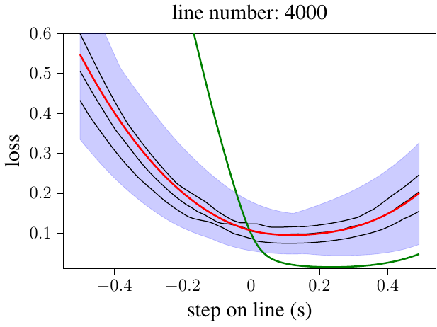
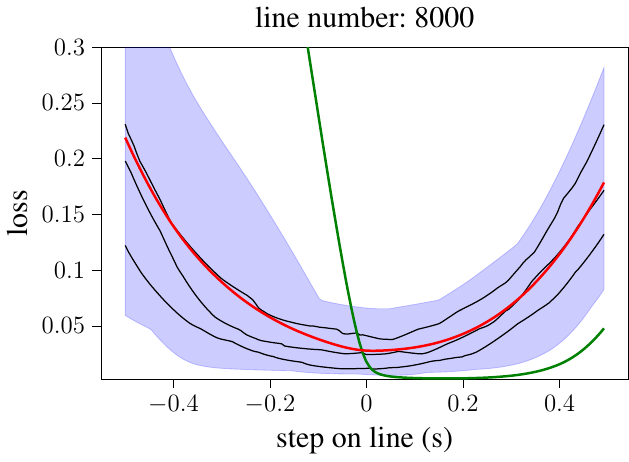

# Empirically explaining SGD from a line search perspective:
This repository provides the code to rerun the experiments from the paper  _Empirically explaining SGD from a line search perspective_ TODO archive link.
Further on, this code can be used to get further results on other datasets and models.

## About the code:
In directory *data_sampling* the code to measure the full-batch loss during SGD training is found. 
Edit the *configuration_sgd_data_sampling.txt* to run the code on different datasets or models. Possible configurations are found in the *registry* directory.

In directory *data_sampling* the code to analyze the loss data along lines is found. 
- *analyze_metrics* creates plots of the full-batch loss along lines such as in Figure 5 and 2 of the paper. In addition, several metrics
(Figure 6) for several optimizers and hyper parameters (such as the batch size (Figure 7)) are computed.
- *analyze_parabolic_shape* calculates the distance MAE between full-batch losses along lines  (Figure 3) and the MAE of the parabolic approximation (Figure 4).
- *analyze_parabolic_shape_all_directions* as above, but this script compares sets of resulting lines of multiple noisy gradient directions originating from the same position.

If you have any questions or suggestions, please do not hesitate to contact me: maximus.mutschler(at)uni-tuebingen.de

## About the paper:
_Empirically explaining SGD from a line search perspective_ analyzes the training trjectory of SGD, used to train a ResNet-20 on 8% of Cifar-10, on a significantly deeper level.
For each update step the full-batch loss as well as all sample losses are measured on a line in update step direction.
Form these measurements the following core results are obtained:
1. the full batch loss along line in update step direction behaves parabolic.
2. with the correct learning rate SGD always performs an exact line search on the full-batch loss.
3. Increasing the batch size by a factor has the same effect as decreasing the learning rate by the same factor.
4. The update step size to the minimum of the full-batch loss behaves almost proportional to the norm of the direction defining batch.

 

***Fig1: Representative sample, mini-batch and full-batch losses along lines in update step direction***

However, to show the generality of those observations this code has to be run on more datasets and models.
Thus, feel free to do so.

